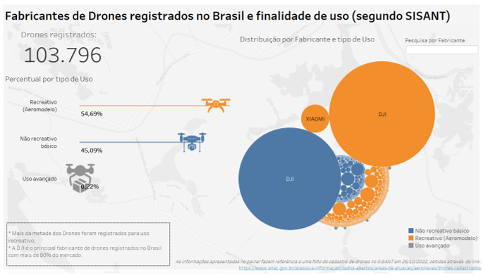

# data-wrangling-SISANT

O objetivo desse pequeno trabalho é limpar e analisar os dados referente ao cadastro de drones disponibilizado no site da ANAC.
As perguntas que estão no centro desta análise são:
* Quantos drones estão registrados no SISANT?
* Qual é a finalidade de uso desses equipamentos?
* Quais são os principais fabricantes que disputam esse mercado?

O projeto em si, está dividido nas etapas abaixo:
* O arquivo "sisant.ipynb" contém o script para realizar a limpeza e padronização dos dados;
* O Dashboard interativo foi publicado no Tableau Public.

Imagem do Dashboard publicado no Tableau Public:

Link: https://public.tableau.com/app/profile/marlon2518/viz/DronesBrasil/Painel

Fonte: https://www.anac.gov.br/acesso-a-informacao/dados-abertos/paineis-de-dados-abertos 
